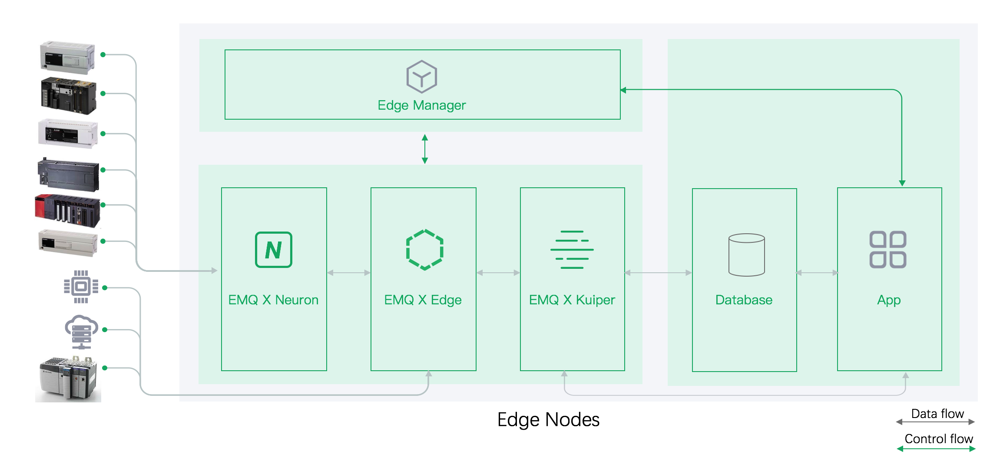
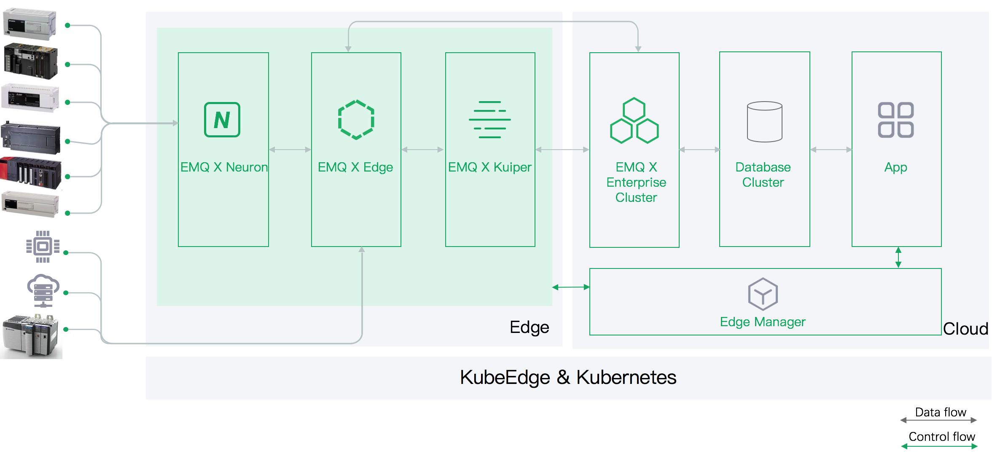

# EMQ X edge stack

[English](README.md)|[简体中文](README-CN.md)

The EMQ X edge stack consolidates all of EMQ edge softwares, and user can start to use edge stack with one-click deployment.

- Edge Manager: It's a web based tool which consolidates management console of Neuron, Edge & Kuiper, user can set Neuron configuration, manage MQTT broker status & Kuiper rules etc through the web based management console. The edge manager is not open-sourced, but user can use it by free.
- Neuron: [Neuron](https://www.emqx.io/products/neuron) is an IoT edge industrial protocol gateway software, which supports one-stop access to dozens of industrial protocols and converts them into MQTT protocol to access the cloud industrial IoT platform.
- Edge: [Edge](https://www.emqx.io/products/edge) is a light-weight edge computing message middleware for IoT, which supports deployment of edge hardware in a resource-constrained environment.
- Kuiper: [Kuiper](https://www.emqx.io/products/kuiper) is a SQL based IoT streaming framwork running at resource constrained edge devices. It continuously ingest, filter, transform, and route the data streamed from EMQ X Edge. User can leverage Kuiper to do stream analytics and rules engine etc.
- Database: After processed by Kuiper, the processed result can be saved into databases, such as `Time Series dababase`, in our demo scenario, we used [TDengine](https://www.taosdata.com/).
- Application: The application extracts data from database and provides interactive UI to end-user. It can also issues management rest-apis to `Edge Manager` and manage the middle-wares deployed at edge node.

## Quick start

As described in previous section, we prepared a [tutorial doc](developer-scripts/README.md), which allows you to deploy a docker & docker-compose based demo environment within several minutes.

## An edge stack and cloud integration solution

If there are multiple edge nodes to be managed, and you want to manage the edge nodes from cloud, you can deploy edge stack softwares as in below architecture. The major difference is that `Edge Manager` is deployed at cloud side, so user can manage all edge middle-wares from cloud.

This solution can be based on Kubernetes implementations, such as use KubeEdge in edge side to manage middle-ware deployments.

## License

[Apache 2.0](LICENSE)

