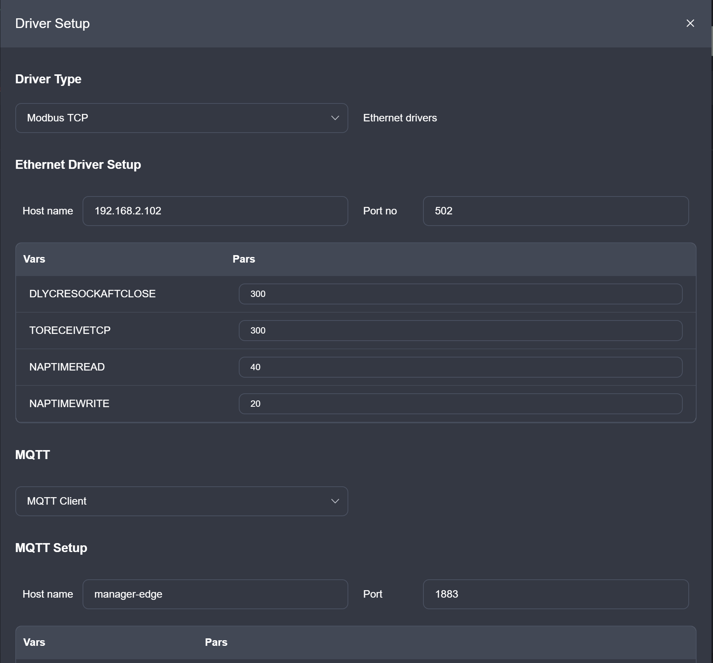
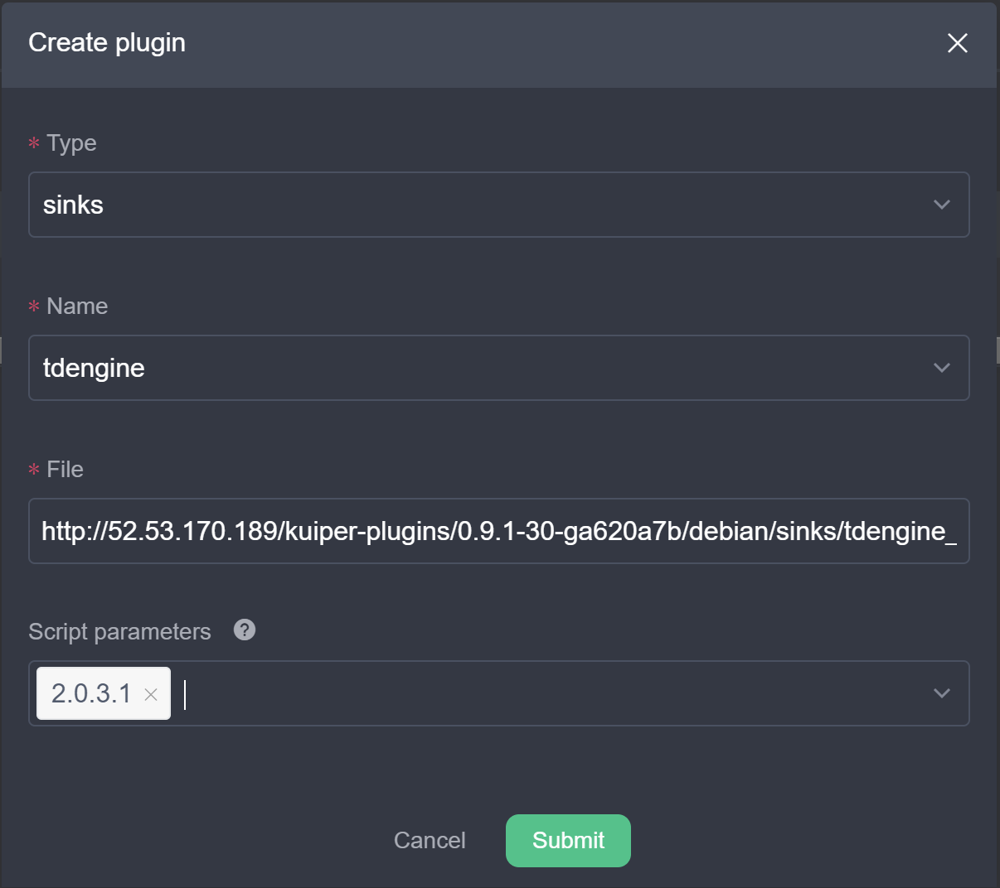

# Developer Scripts

[English](README.md)|[简体中文](README-CN.md)

This folder contains scripts and docker compose files to quickly set up the EMQ X Edge Stack.

## Running on Linux

### Install docker & docker-compose

**Docker**

Refer to [install docker document](https://docs.docker.com/get-docker/) for more detailed information.

**Docker-compose**

Below is an example for how to install docker-compose in centos-7, you can find docker-compose install instruction for other Linux system through Google.

https://linuxize.com/post/how-to-install-and-use-docker-compose-on-centos-7/

Below is an example for how to install docker-compose in ubuntu18 arm.

```
apt-get install python3 python3-dev python3-pip libffi-dev libevent-dev
pip3 install docker-compose
```


### Up & running

For convenience, the `run.sh` will help you get up and running. It will add,

- The local Kuiper, Neuron and Edge nodes; 
- Create a stream named "neuron" in Kuiper which connects to the local neuron's telemetry mqtt topic. 
- Create a default database in TDengine and add it to Grafana data source.  

```bash
git clone git@github.com:emqx/edge-stack.git
cd $edge-stack
developer-scripts/run.sh
```

### Setup Neuron

Open Neuron dashboard by click `Neuron` in the left menu, and then click `local_neuron` node. Then do the following setup.

1. Install the Modbus simulator: *PeakHMISlaveSimulator*. After installation, open **Modbus TCP slave**.
2. In the neuron dashboard, open Configuration -> Object Setup. Click *Edit Driver*, and setup the modbus tcp driver and mqtt.
    
    - Driver type: **Modbus TCP**.
    - Host name: Fill in the host where the Modbus simulator is running on.
    - Port: **502** by default.
    - MQTT Host name: **manager-edge**, which is the local emqx edge node.
    - MQTT Port: **1883**.
    
    
    
    If the driver setup is correct, the Modbus simulator should show 1 client connected and keep receiving. Click "Submit" button, the **Modbus TCP** become the current driver.
3. Click "Import" button, select [neuron_batch_modbus_5.xlsx](neuron_batch_modbus_5.xlsx). There should be a new line added in the object table. Then click "Send" button at the top-right corner, which will send the configuration to Neuron and restart it.
4. The setup is done now. Then verify that neuron has connect to the EMQX edge. 
    1. Click **edge** in the left menu. Then click **local_edge** in the node list to enter the EMQX edge dashboard.
    2. In the edge dashboard, click **clients** in the left menu. There should be one client.

### Setup Kuiper

Open Kuiper dashboard by click `Kuiper` in the left menu, and then click `local_kuiper` node. Then do the following setup.

1. Make sure the `neuron` stream is created. Go to the "Stream" tab, make sure a stream named `neuron` is in the stream list.
   
2. Switch to "Plugins" tab, click "Create plugin", and setup as below. This will create the tdengine plugin so that the rule result can be ported to tdengine.
     
   
   
3. Create a rule. A rule will be created for subscribing data published by Neuron, and send the analysis result to TDengine. Switch to "Rules" tab, click "Create rule". Switch to "Text mode" in the top-right. Fill in Rule ID: **ruleNeuron** or any rule name you want. Enter the below json in the "text" field.

    ```json
    {
      "sql": "SELECT tele[0]->Tag00001 AS temperature, tele[0]->Tag00002 AS humidity FROM neuron",
      "actions": [
        {
          "tdengine": {
            "ip": "taos",
            "port": 0,
            "user": "root",
            "password": "taosdata",
            "database": "db",
            "table": "t",
            "fields": ["temperature","humidity"],
            "provideTs": false,
            "tsFieldName": "ts"
          }
        }
      ]
    }
    ```
4. Click "Submit", make sure the rule is up and running. Click the rule status, there should be data in and out in the metrics.

### Query data in TDengine

1. Go into the docker container of TDengine. 
      
   ```bash
   docker exec -it manager-taos /bin/sh      
   ```
   
2. The rule data is in database **db**, table **t**. Query the data with SQL like `use db;select * from t;`.

### Data visualization data with Grafana

A default dashboard was automatically created by the script which connects to the TDengin **db.t** table. Open **http://yourhost:3000/dashboards** in the browser, click **taos** dashboard. It will show the temperature change over time visually.

## How to reset test environment

If you having any problems with your environment, then you can run following command to reset your environment. 

```shell
cd developer-scripts
docker-compose -p emqx_edge_stack down
```

*Please notice that command `docker rm docker ps -qa` will remove all of docker instances, if you have docker instances other than edge-stacks and do not want to have all of them removed, please remove edge stack instances one by one.*


## Appendix

### Run docker compose directly

The default running compose file is `docker-compose.yml`. To run another docker compose file, use:

```bash
./run.sh docker-compose-test.yml
```

To stop the current stack, run the command in the current folder.

```bash
docker-compose stop
```

Please refer to [docker compose doc](https://docs.docker.com/compose/reference/overview/) for more cli commands.

If you only need to start up all dependant docker container without initializing any data, you can just run the docker compose file directly.

### Run docker compose

Run docker compose in this folder.

```bash
docker-compose up -d
```

Edge manager will run at `http://yourhost:9082`. Two nodes are ready:

1. Kuiper: `http://manager-kuiper:9081`.
2. Edge: `http://manager-edge:8081`.
3. Neuron: `http://manager-neuron:7000`

Notice that, these three nodes are running internally. If you need to access them externally, please modify the `ports` in docker-compose.yml to remove `127.0.0.1`. For example, kuiper ports `"127.0.0.1:9081:9081"` should be changed to `"9081:9081"`.

You can add nodes in the edge manager nodes page.

### Run Docker compose test

For testing docker images, modify the `docker-compose-test.yml` to point the image to local images and run it.

```bash
docker-compose -f docker-compose-test.yml up -d
```

Modify the `docker-compose-test.yml` to configure the ports, environment variables etc.
